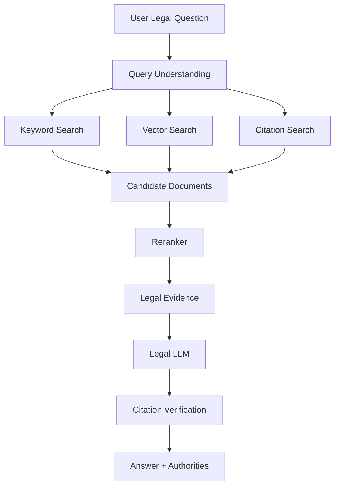
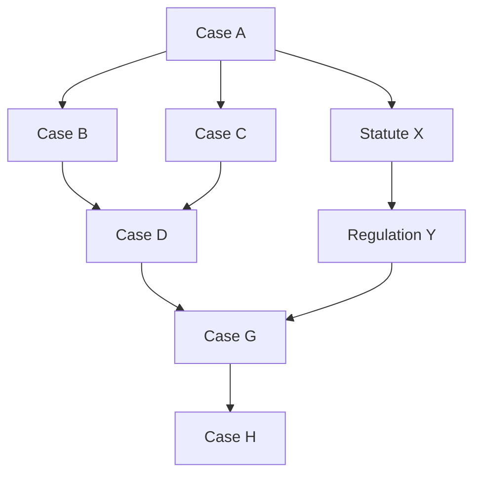
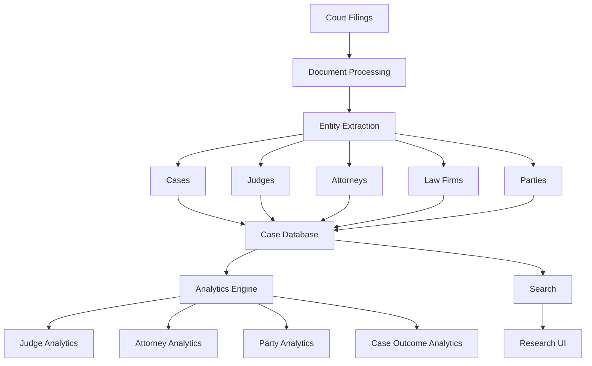
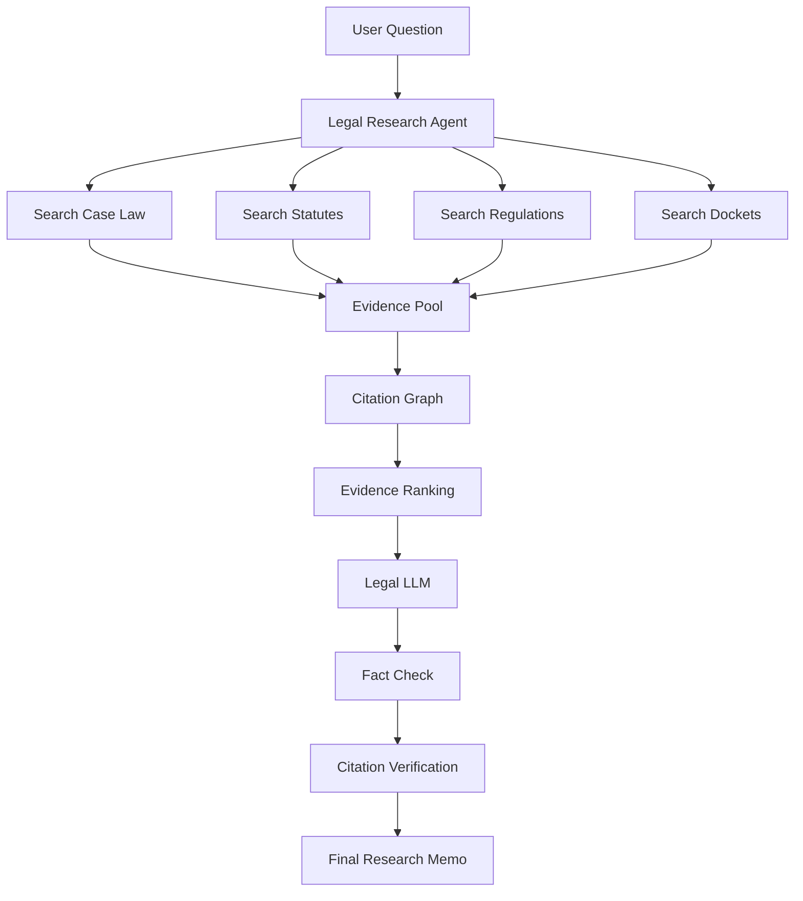
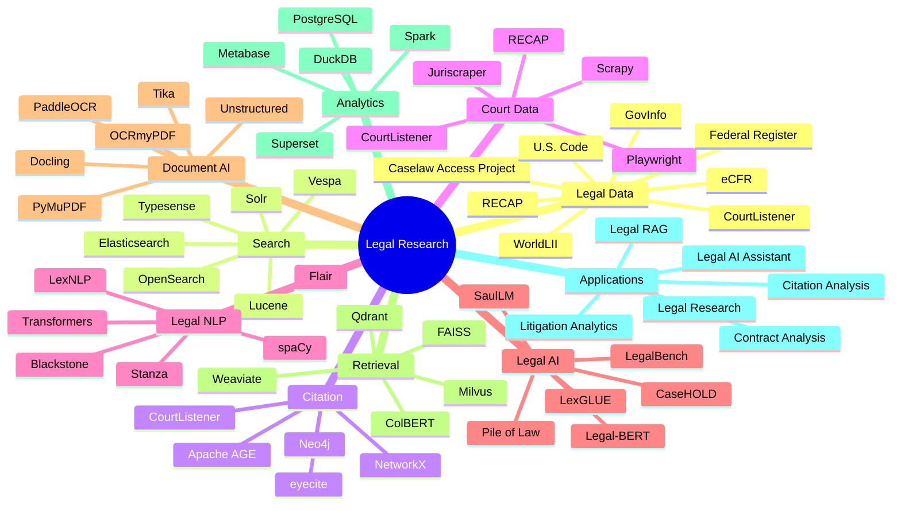
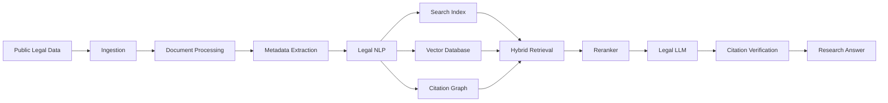

# Awesome-Legal-Research-Platform

## ⚖️ Top Legal Research Platforms & Open-Source Legal AI

> A curated list of **legal research platforms, AI legal research assistants, legal analytics systems, litigation intelligence platforms, legal databases and open-source software** for researching case law, statutes, regulations, dockets, citations and legal documents.

Modern legal research platforms increasingly combine:

* Case law search
* Statutory and regulatory research
* Legal citations
* Shepardizing / KeyCite-style citator functionality
* Docket and litigation research
* Legal analytics
* Document analysis
* Contract analysis
* AI-assisted research
* Legal drafting
* Citation verification
* Natural-language search
* RAG over legal corpora
* Legal entity extraction
* Court and judge analytics

This repository focuses primarily on the **open-source and open-data ecosystem** that can be used to build self-hosted alternatives to commercial platforms such as **Lexis+ AI, Westlaw Precision AI, vLex, Fastcase, CoCounsel, Harvey AI, Bloomberg Law, Descrybe.ai, Paxton AI and Lex Machina**.

There is an important distinction between **open legal data** and a **commercial legal research platform**.

Open-source projects can provide the software infrastructure for:

```text
Legal Data
    +
Search
    +
Citation Analysis
    +
Document Processing
    +
Legal NLP
    +
RAG
    +
LLMs
    +
Legal Analytics
    =
Open-Source Legal Research Platform
```

However, proprietary publishers often possess licensed collections of:

* Case law
* Statutes
* Regulations
* Court documents
* Treatises
* Briefs
* Secondary sources
* Editorial annotations
* Citators
* Litigation analytics

Therefore, an open-source Lexis/Westlaw alternative generally requires **both open-source software and legally usable legal datasets**.

---

## 📑 Table of Contents

* [☁️ SaaS/Hosted Platforms](#️-saashosted-platforms)
* [🌍 Open-Source](#-open-source)
* [⚖️ Open Legal Research Platforms](#️-open-legal-research-platforms)
* [📚 Open Legal Data & Case Law](#-open-legal-data--case-law)
* [🔎 Open-Source Legal Search](#-open-source-legal-search)
* [🕸️ Open-Source Court Data & Scraping](#️-open-source-court-data--scraping)
* [🧾 Open-Source Citation Analysis](#-open-source-citation-analysis)
* [🧠 Open-Source Legal NLP](#-open-source-legal-nlp)
* [🤖 Open-Source Legal AI & LLMs](#-open-source-legal-ai--llms)
* [📄 Open-Source Legal Document AI](#-open-source-legal-document-ai)
* [🗂️ Open-Source Legal Document Management](#️-open-source-legal-document-management)
* [📊 Open-Source Legal Analytics](#-open-source-legal-analytics)
* [👨‍⚖️ Open-Source Court & Litigation Intelligence](#️-open-source-court--litigation-intelligence)
* [🧪 Open Legal AI Datasets & Benchmarks](#-open-legal-ai-datasets--benchmarks)
* [🧩 Commercial Platform → Open-Source Equivalent](#-commercial-platform--open-source-equivalent)
* [🏗️ Legal Research Architecture](#️-legal-research-architecture)
* [🔄 Open-Source Legal RAG Architecture](#-open-source-legal-rag-architecture)
* [🔗 Legal Citation Graph](#-legal-citation-graph)
* [⚖️ Commercial vs Open-Source](#️-commercial-vs-open-source)
* [🚀 Recommended Open-Source Stacks](#-recommended-open-source-stacks)
* [📊 Legal Research Technology Comparison](#-legal-research-technology-comparison)
* [🎯 Recommended Projects by Use Case](#-recommended-projects-by-use-case)
* [🏢 Building a Lexis+ AI Alternative](#-building-a-lexis-ai-alternative)
* [🏛️ Building a Westlaw Alternative](#️-building-a-westlaw-alternative)
* [📈 Building a Lex Machina Alternative](#-building-a-lex-machina-alternative)
* [🤖 Building an Open-Source Legal AI Assistant](#-building-an-open-source-legal-ai-assistant)
* [🌐 Open-Source Legal Research Landscape](#-open-source-legal-research-landscape)
* [🧠 Why Open Legal Research Matters](#-why-open-legal-research-matters)
* [🤝 Contributing](#-contributing)
* [⚠️ Disclaimer](#️-disclaimer)

---

# ☁️ SaaS/Hosted Platforms

Commercial legal research platforms combine proprietary legal databases, search infrastructure, editorial curation, analytics and increasingly generative AI.

| Platform                                                                               | Company         | Primary Focus              | Key Capabilities                                                           |
| -------------------------------------------------------------------------------------- | --------------- | -------------------------- | -------------------------------------------------------------------------- |
| [Lexis+ AI](https://www.lexisnexis.com/)                                               | LexisNexis      | Legal research + AI        | Legal research, generative AI, citations, drafting and document analysis   |
| [Westlaw Precision AI](https://legal.thomsonreuters.com/en/products/westlaw-precision) | Thomson Reuters | Legal research + AI        | Case law, statutes, KeyCite, AI research and litigation analysis           |
| [vLex](https://vlex.com/)                                                              | vLex            | Global legal research      | Global legal content, AI research and legal intelligence                   |
| [Fastcase](https://www.fastcase.com/)                                                  | Fastcase        | Legal research             | Case law, statutes, legal research and citation tools                      |
| [CoCounsel](https://www.cocounsel.com/)                                                | Thomson Reuters | Legal AI assistant         | Research, document review, analysis, drafting and legal workflows          |
| [Harvey](https://www.harvey.ai/)                                                       | Harvey          | Enterprise legal AI        | Legal research, analysis, drafting and workflow automation                 |
| [Bloomberg Law](https://pro.bloomberglaw.com/)                                         | Bloomberg       | Legal research + analytics | Legal research, dockets, litigation analytics and AI                       |
| [Descrybe.ai](https://www.descrybe.ai/)                                                | Descrybe        | AI legal research          | Natural-language legal research and legal intelligence                     |
| [Paxton AI](https://www.paxton.ai/)                                                    | Paxton          | Legal AI                   | Legal research, drafting, document analysis and workflows                  |
| [Lex Machina](https://lexmachina.com/)                                                 | LexisNexis      | Litigation analytics       | Judges, attorneys, parties, courts, case outcomes and litigation analytics |
| [Casetext](https://casetext.com/)                                                      | Thomson Reuters | Legal research / AI        | AI-assisted legal research and document analysis                           |
| [Practical Law](https://legal.thomsonreuters.com/en/products/practical-law)            | Thomson Reuters | Legal know-how             | Practice notes, clauses, checklists and legal guidance                     |
| [Fastcase](https://www.fastcase.com/)                                                  | Fastcase        | Case law research          | Case law, statutes, citation analysis                                      |
| [Legora](https://legora.com/)                                                          | Legora          | AI legal work              | Legal research, drafting and workflow automation                           |
| [Clio](https://www.clio.com/)                                                          | Clio            | Legal practice management  | Practice management, documents, billing and workflows                      |
| [vLex Vincent AI](https://vlex.com/)                                                   | vLex            | Legal AI                   | AI-powered research over legal content                                     |
| [Bloomberg Law AI](https://pro.bloomberglaw.com/)                                      | Bloomberg       | Legal AI                   | AI research and legal analysis                                             |

---

# 🌍 Open-Source

The open-source legal research ecosystem is considerably more fragmented than commercial legal research.

Instead of one monolithic Lexis/Westlaw replacement, the ecosystem is composed of:

```text
                 OPEN LEGAL RESEARCH
                         │
        ┌────────────────┼────────────────┐
        │                │                │
        ▼                ▼                ▼
    Legal Data        Search          Legal NLP
        │                │                │
        ▼                ▼                ▼
 CourtListener       Elasticsearch    eyecite
    RECAP             OpenSearch      LexNLP
    CAP Data          Solr            spaCy
        │                │                │
        └────────────────┼────────────────┘
                         │
                         ▼
                    Legal RAG
                         │
                         ▼
                   Open LLM / VLM
                         │
                         ▼
              Legal Research Assistant
```

The most important open ecosystem is arguably the combination of **Free Law Project + CourtListener + RECAP + legal NLP + open legal datasets + open LLM infrastructure**.

CourtListener currently provides millions of legal decisions, federal filings, dockets, oral arguments, judges and related legal data, while Free Law Project maintains a broader ecosystem of open legal research tools.

---

# ⚖️ Open-Source Legal Research Platforms

## CourtListener

[**CourtListener**](https://github.com/freelawproject/courtlistener) is one of the most important open-source projects for building legal research systems.

It provides:

* Case law search
* Federal court filings
* PACER/RECAP data
* Dockets
* Oral arguments
* Judge information
* Citation analysis
* Alerts
* Legal APIs
* Search infrastructure

CourtListener currently reports more than **9 million decisions from over 2,000 courts** and provides programmatic access through APIs and other data-access mechanisms.

| Project                                                                                | Description                                  |
| -------------------------------------------------------------------------------------- | -------------------------------------------- |
| [CourtListener](https://github.com/freelawproject/courtlistener)                       | Open legal research and court-data platform  |
| [RECAP](https://github.com/freelawproject/recap)                                       | Open archive of PACER documents and metadata |
| [Juriscraper](https://github.com/freelawproject/juriscraper)                           | Court website scraping framework             |
| [eyecite](https://github.com/freelawproject/eyecite)                                   | Legal citation extraction and parsing        |
| [Doctor](https://github.com/freelawproject/doctor)                                     | Document processing service                  |
| [CourtListener API Client](https://github.com/freelawproject/courtlistener-api-client) | Python API / MCP tooling                     |
| [RECAP Browser Extension](https://github.com/freelawproject/recap-chrome)              | Browser-based PACER/RECAP integration        |
| [Blackletter](https://github.com/freelawproject/blackletter)                           | Legal document processing                    |

Free Law Project describes its mission as providing free access to primary legal materials and developing technology for legal research and legal corpora.

---

# 📚 Open Legal Data & Case Law

Open legal data is the foundation for an open-source legal research platform.

| Dataset / Project                                    | Description                                     |
| ---------------------------------------------------- | ----------------------------------------------- |
| [CourtListener](https://courtlistener.com/)          | Millions of U.S. opinions, dockets and filings  |
| [RECAP Archive](https://free.law/recap/)             | Federal court filings and docket data           |
| [Caselaw Access Project](https://case.law/)          | Large historical U.S. case-law collection       |
| [GovInfo](https://www.govinfo.gov/)                  | U.S. government legal publications              |
| [Federal Register](https://www.federalregister.gov/) | Federal rules, notices and proposed regulations |
| [eCFR](https://www.ecfr.gov/)                        | Electronic Code of Federal Regulations          |
| [U.S. Code](https://uscode.house.gov/)               | United States Code                              |
| [Congress.gov](https://www.congress.gov/)            | Legislative information                         |
| [Oyez](https://www.oyez.org/)                        | U.S. Supreme Court information and audio        |
| [Supreme Court Database](http://scdb.wustl.edu/)     | Structured Supreme Court decision data          |
| [WorldLII](https://www.worldlii.org/)                | Global legal information                        |
| [Open Legal Data](https://openlegaldata.io/)         | Legal data and legal NLP research               |
| [SALI Alliance](https://www.sali.org/)               | Legal industry data standards and ontology      |
| [Legal Data Institute](https://www.law.cornell.edu/) | Open legal information resources                |

The open legal-data ecosystem includes CourtListener, RECAP, Caselaw Access Project, GovInfo, eCFR, Federal Register and other public sources.

---

# 🔎 Open-Source Legal Search

A legal research engine generally requires several search layers:

```text
Keyword Search
      +
Boolean Search
      +
Citation Search
      +
Semantic Search
      +
Entity Search
      +
Metadata Filtering
      +
Citation Graph
      =
Legal Search Engine
```

| Project                                                        | Role                           |
| -------------------------------------------------------------- | ------------------------------ |
| [OpenSearch](https://github.com/opensearch-project/OpenSearch) | Search engine                  |
| [Elasticsearch](https://github.com/elastic/elasticsearch)      | Search engine                  |
| [Apache Solr](https://github.com/apache/solr)                  | Search platform                |
| [Apache Lucene](https://github.com/apache/lucene)              | Search engine library          |
| [Vespa](https://github.com/vespa-engine/vespa)                 | Large-scale search and ranking |
| [Typesense](https://github.com/typesense/typesense)            | Fast search engine             |
| [Meilisearch](https://github.com/meilisearch/meilisearch)      | Search engine                  |
| [Qdrant](https://github.com/qdrant/qdrant)                     | Vector search                  |
| [Milvus](https://github.com/milvus-io/milvus)                  | Vector database                |
| [Weaviate](https://github.com/weaviate/weaviate)               | Vector database                |
| [FAISS](https://github.com/facebookresearch/faiss)             | Vector similarity search       |

A production legal research engine can combine:

```text
BM25
 +
Vector Search
 +
Citation Search
 +
Metadata Filters
 +
Citation Graph
 +
Reranking
```

---

# 🕸️ Open-Source Court Data & Scraping

Court data often comes from heterogeneous government websites.

The Free Law Project ecosystem includes **Juriscraper**, which provides tooling for extracting court metadata from U.S. court websites.

| Project                                                          | Description                 |
| ---------------------------------------------------------------- | --------------------------- |
| [Juriscraper](https://github.com/freelawproject/juriscraper)     | Scraping court websites     |
| [RECAP](https://github.com/freelawproject/recap)                 | PACER data collection       |
| [RECAP Chrome](https://github.com/freelawproject/recap-chrome)   | Browser extension for RECAP |
| [CourtListener](https://github.com/freelawproject/courtlistener) | Court-data aggregation      |
| [Scrapy](https://github.com/scrapy/scrapy)                       | General web scraping        |
| [Playwright](https://github.com/microsoft/playwright)            | Browser automation          |
| [Selenium](https://github.com/SeleniumHQ/selenium)               | Browser automation          |

---

# 🧾 Open-Source Citation Analysis

Citation analysis is one of the most important components of a legal research platform.

```text
Case A
  │
  ├──── cites ────► Case B
  │
  ├──── cites ────► Case C
  │
  └──── cites ────► Statute X
```

This can be converted into a graph:

```text
                    Case A
                  /   |   \
                 ▼    ▼    ▼
              Case B Case C Statute
                │      │
                ▼      ▼
             Case D  Case E
```

| Project                                                          | Capability                        |
| ---------------------------------------------------------------- | --------------------------------- |
| [eyecite](https://github.com/freelawproject/eyecite)             | Citation extraction               |
| [CourtListener](https://github.com/freelawproject/courtlistener) | Citation graph and legal research |
| [Juriscraper](https://github.com/freelawproject/juriscraper)     | Court metadata                    |
| [spaCy](https://github.com/explosion/spaCy)                      | NLP pipeline                      |
| [NetworkX](https://github.com/networkx/networkx)                 | Citation graph analysis           |
| [Neo4j](https://github.com/neo4j/neo4j)                          | Graph database                    |
| [Apache AGE](https://github.com/apache/age)                      | Graph extension for PostgreSQL    |

CourtListener's API includes citation-related functionality, including citation lookup and graph analysis.

---

# 🧠 Open-Source Legal NLP

Legal research requires specialized NLP for:

* Case names
* Statutes
* Citations
* Judges
* Courts
* Attorneys
* Parties
* Legal entities
* Dates
* Holdings
* Legal issues
* Authorities
* Contracts
* Clauses

| Project                                                                  | Description                            |
| ------------------------------------------------------------------------ | -------------------------------------- |
| [LexNLP](https://github.com/LexPredict/lexpredict-lexnlp)                | NLP tools for legal and financial text |
| [eyecite](https://github.com/freelawproject/eyecite)                     | Legal citation extraction              |
| [spaCy](https://github.com/explosion/spaCy)                              | NLP framework                          |
| [Hugging Face Transformers](https://github.com/huggingface/transformers) | Transformer models                     |
| [Apache OpenNLP](https://github.com/apache/opennlp)                      | NLP toolkit                            |
| [Stanza](https://github.com/stanfordnlp/stanza)                          | NLP pipeline                           |
| [Flair](https://github.com/flairNLP/flair)                               | NLP framework                          |
| [AllenNLP](https://github.com/allenai/allennlp)                          | NLP research framework                 |
| [Presidio](https://github.com/microsoft/presidio)                        | PII detection and anonymization        |

---

# ⚖️ Legal Named Entity Recognition

Legal NER can identify:

```text
PERSON
ORGANIZATION
COURT
CASE
STATUTE
REGULATION
JUDGE
LAWYER
DATE
LOCATION
LEGAL_CONCEPT
CITATION
```

Example:

```text
"The Supreme Court held in Brown v. Board of Education..."

        ↓

COURT        → Supreme Court
CASE         → Brown v. Board of Education
LEGAL_EVENT  → held
```

Useful technologies:

* spaCy
* Hugging Face Transformers
* Legal-BERT
* RoBERTa
* DeBERTa
* LexNLP
* Stanza
* GLiNER
* Presidio

---

# 🤖 Open-Source Legal AI & LLMs

Legal research systems can combine open legal data with general-purpose or legal-specialized language models.

| Model / Project                                                        | Description                         |
| ---------------------------------------------------------------------- | ----------------------------------- |
| [Legal-BERT](https://huggingface.co/nlpaueb/legal-bert-base-uncased)   | BERT adapted to legal text          |
| [CaseHOLD](https://github.com/reglab/casehold)                         | Legal reasoning benchmark / dataset |
| [LegalBench](https://github.com/HazyResearch/legalbench)               | Legal reasoning benchmark           |
| [Pile of Law](https://huggingface.co/datasets/pile-of-law/pile-of-law) | Large legal text dataset            |
| [SaulLM](https://huggingface.co/Equall/SaulLM-7B-Instruct)             | Legal language model family         |
| [LegalLAMA](https://github.com/JoelNiklaus/LegalLAMA)                  | Legal language modeling             |
| [LexGLUE](https://github.com/coastalcph/lex-glue)                      | Legal NLP benchmark                 |
| [Blackstone](https://github.com/ICLRandBlackstone/Blackstone)          | Legal NLP toolkit                   |
| [Legal-BERT](https://github.com/coastalcph/lex-glue)                   | Legal-domain transformer ecosystem  |

---

# 📄 Open-Source Legal Document AI

Legal research platforms frequently need to process:

* Court opinions
* Complaints
* Motions
* Briefs
* Contracts
* Statutes
* Regulations
* Exhibits
* PDFs
* Scanned filings

| Project                                                         | Role                        |
| --------------------------------------------------------------- | --------------------------- |
| [Docling](https://github.com/docling-project/docling)           | Document parsing            |
| [PaddleOCR](https://github.com/PaddlePaddle/PaddleOCR)          | OCR and document AI         |
| [OCRmyPDF](https://github.com/ocrmypdf/OCRmyPDF)                | OCR for PDFs                |
| [PyMuPDF](https://github.com/pymupdf/PyMuPDF)                   | PDF processing              |
| [Apache Tika](https://github.com/apache/tika)                   | Document extraction         |
| [Unstructured](https://github.com/Unstructured-IO/unstructured) | Document parsing            |
| [Marker](https://github.com/datalab-to/marker)                  | PDF → Markdown              |
| [MinerU](https://github.com/opendatalab/MinerU)                 | Document parsing            |
| [GROBID](https://github.com/kermitt2/grobid)                    | Scientific/document parsing |
| [Tesseract](https://github.com/tesseract-ocr/tesseract)         | OCR                         |

---

# 🗂️ Open-Source Legal Document Management

| Project                                                                   | Description                     |
| ------------------------------------------------------------------------- | ------------------------------- |
| [OpenKM](https://github.com/openkm/document-management-system)            | Document management             |
| [Mayan EDMS](https://github.com/mayan-edms/Mayan-EDMS)                    | Open-source document management |
| [Paperless-ngx](https://github.com/paperless-ngx/paperless-ngx)           | Document management             |
| [Nextcloud](https://github.com/nextcloud/server)                          | File and document collaboration |
| [Docspell](https://github.com/eikek/docspell)                             | Document organizer              |
| [Alfresco Community](https://github.com/Alfresco/alfresco-community-repo) | Enterprise content management   |

These can provide the document repository layer underneath a legal research or legal AI system.

---

# 📊 Open-Source Legal Analytics

Commercial platforms such as Lex Machina and Bloomberg Law combine legal documents with structured analytics.

An open implementation can use:

```text
Court Data
   │
   ▼
Entity Extraction
   │
   ├── Judges
   ├── Attorneys
   ├── Parties
   ├── Firms
   ├── Courts
   └── Cases
   │
   ▼
Structured Database
   │
   ▼
Analytics
   │
   ├── Win Rates
   ├── Case Outcomes
   ├── Judge Statistics
   ├── Filing Trends
   ├── Duration
   ├── Damages
   └── Litigation Patterns
```

Useful technologies:

| Technology      | Role                       |
| --------------- | -------------------------- |
| CourtListener   | Source legal data          |
| RECAP           | Federal litigation data    |
| PostgreSQL      | Structured storage         |
| DuckDB          | Analytics                  |
| Apache Spark    | Large-scale processing     |
| Pandas          | Data analysis              |
| Polars          | High-performance analytics |
| NetworkX        | Citation networks          |
| Neo4j           | Litigation graphs          |
| Apache Superset | BI dashboards              |
| Metabase        | Analytics dashboards       |
| Grafana         | Visualization              |

---

# 👨‍⚖️ Open-Source Court & Litigation Intelligence

A litigation intelligence system can model:

```text
                    Case
                     │
        ┌────────────┼────────────┐
        ▼            ▼            ▼
      Judge        Plaintiff    Defendant
        │            │            │
        ▼            ▼            ▼
    Court/Firm     Attorney      Attorney
        │
        ▼
     Outcome
```

Possible data sources:

* CourtListener
* RECAP
* PACER-derived data
* Court websites
* State court systems
* Federal Register
* Government datasets

Free Law Project states that the RECAP archive contains hundreds of millions of docket entries and millions of documents, making it a major foundation for open federal litigation research.

---

# 🧪 Open Legal AI Datasets & Benchmarks

| Dataset / Benchmark                                                    | Focus                                    |
| ---------------------------------------------------------------------- | ---------------------------------------- |
| [LegalBench](https://github.com/HazyResearch/legalbench)               | Legal reasoning                          |
| [LexGLUE](https://github.com/coastalcph/lex-glue)                      | Legal NLP                                |
| [CaseHOLD](https://github.com/reglab/casehold)                         | Case-law reasoning                       |
| [Pile of Law](https://huggingface.co/datasets/pile-of-law/pile-of-law) | Legal language corpus                    |
| [CUAD](https://github.com/TheAtticusProject/cuad)                      | Contract understanding                   |
| [LEDGAR](https://github.com/futuredata/empirical-law)                  | Legal clause classification              |
| [ContractNLI](https://stanfordnlp.github.io/contract-nli/)             | Contract inference                       |
| [COLIEE](https://sites.ualberta.ca/~rabelo/COLIEE2025/)                | Legal information extraction / reasoning |
| [Oyez](https://www.oyez.org/)                                          | Supreme Court information                |
| [Caselaw Access Project](https://case.law/)                            | U.S. case law                            |
| [CourtListener](https://courtlistener.com/)                            | U.S. case law and litigation data        |

---

# 🧩 Commercial Platform → Open-Source Equivalent

| Commercial Platform      | Open-Source Equivalent / Building Blocks                                            |
| ------------------------ | ----------------------------------------------------------------------------------- |
| **Lexis+ AI**            | CourtListener + RECAP + eyecite + OpenSearch + legal LLM                            |
| **Westlaw Precision AI** | CourtListener + legal datasets + citation graph + OpenSearch + LLM                  |
| **vLex**                 | Open Legal Data + CourtListener + jurisdiction-specific datasets + multilingual NLP |
| **Fastcase**             | CourtListener + Caselaw Access Project + OpenSearch                                 |
| **CoCounsel**            | CourtListener + Docling + legal LLM + RAG                                           |
| **Harvey AI**            | Open legal datasets + LLM + RAG + document AI                                       |
| **Bloomberg Law**        | CourtListener + RECAP + public regulatory datasets + analytics                      |
| **Descrybe.ai**          | CourtListener + OpenSearch + legal embeddings + legal LLM                           |
| **Paxton AI**            | CourtListener + legal LLM + RAG + document processing                               |
| **Lex Machina**          | CourtListener + RECAP + entity extraction + PostgreSQL + analytics                  |
| **Casetext**             | CourtListener + OpenSearch + citation extraction + RAG                              |
| **Legal Research AI**    | CourtListener + eyecite + reranker + legal LLM                                      |
| **Legal Citator**        | CourtListener + eyecite + citation graph + graph database                           |
| **Litigation Analytics** | RECAP + CourtListener + PostgreSQL + NLP + BI                                       |
| **AI Legal Assistant**   | Legal corpus + embeddings + reranker + LLM + citation verification                  |

---

# 🏗️ Legal Research Architecture

```text id="psd6pr"
                           USER
                            │
                            ▼
                    Natural Language Query
                            │
                            ▼
                  ┌─────────────────────┐
                  │   Query Processor   │
                  └──────────┬──────────┘
                             │
             ┌───────────────┼───────────────┐
             ▼               ▼               ▼
         Keyword          Semantic        Citation
          Search           Search          Search
             │               │               │
             └───────────────┼───────────────┘
                             ▼
                       Candidate Cases
                             │
                             ▼
                         Reranker
                             │
                             ▼
                       Citation Graph
                             │
                             ▼
                       Legal Documents
                             │
                             ▼
                         Legal LLM
                             │
                             ▼
                  Citation-Verified Answer
```

---

# 🔄 Open-Source Legal RAG Architecture



A robust legal AI system should keep **retrieval, evidence and generation separate** rather than allowing the language model to generate unsupported legal authorities.

---

# 🔗 Legal Citation Graph

One of the most valuable components of a Westlaw/Lexis-style research system is the citation network.



This graph enables:

* Cited-by search
* Citation counts
* Authority discovery
* Precedent chains
* Related cases
* Treatment analysis
* Citation networks
* Case clustering
* Legal knowledge graphs

---

# 🧠 Citation Verification Pipeline

```text
Generated Legal Answer
          │
          ▼
Extract Citations
          │
          ▼
eyecite
          │
          ▼
CourtListener / Legal Database
          │
          ▼
Retrieve Authority
          │
          ▼
Compare Citation
          │
          ▼
Verify Text / Metadata
          │
          ▼
Verified Answer
```

CourtListener's API ecosystem now includes citation lookup functionality specifically useful for verifying citations and creating safeguards against AI hallucinations.

---

# ⚖️ Commercial vs Open-Source

| Capability                    | Commercial Legal Research | Open-Source Stack       |
| ----------------------------- | ------------------------- | ----------------------- |
| Case Law Search               | ✅                         | ✅                       |
| Statutory Search              | ✅                         | ✅                       |
| Natural Language Search       | ✅                         | ✅                       |
| Semantic Search               | ✅                         | ✅                       |
| Citation Extraction           | ✅                         | ✅                       |
| Citation Graph                | ✅                         | ✅                       |
| AI Research                   | ✅                         | ✅                       |
| Legal RAG                     | ✅                         | ✅                       |
| Document Analysis             | ✅                         | ✅                       |
| Litigation Analytics          | ✅                         | ✅ Building Blocks       |
| Judge Analytics               | ✅                         | ✅ Building Blocks       |
| Docket Search                 | ✅                         | ✅                       |
| PACER Data                    | Integrated                | RECAP / external access |
| Editorial Headnotes           | ✅                         | ⚠️ Limited              |
| Proprietary Treatises         | ✅                         | ❌                       |
| Proprietary Citators          | ✅                         | ❌                       |
| Proprietary Secondary Sources | ✅                         | ❌                       |
| Global Coverage               | Often extensive           | Fragmented              |
| Data Ownership                | Vendor-dependent          | Greater control         |
| Model Choice                  | Limited                   | Very High               |
| Fine-Tuning                   | Varies                    | ✅                       |
| Self Hosting                  | Limited                   | ✅                       |
| Air-Gapped                    | Limited                   | ✅                       |
| Custom Search                 | Limited                   | ✅                       |
| Vendor Lock-In                | Higher                    | Lower                   |
| Infrastructure Cost           | Subscription              | Self-managed            |
| Legal Licensing               | Vendor-managed            | Must verify             |
| Regulatory / Legal Risk       | Vendor terms              | User responsibility     |

---

# 🚀 Recommended Open-Source Stacks

## 🥇 1. General Legal Research

```text id="t5s5a2"
CourtListener
      +
RECAP
      +
OpenSearch
      +
eyecite
      +
BGE Embeddings
      +
Reranker
      +
Legal LLM
```

---

# 🔎 2. Lexis/Westlaw-Style Search

```text id="p5br4g"
Legal Corpus
     │
     ├── Case Law
     ├── Statutes
     ├── Regulations
     └── Dockets
     │
     ▼
OpenSearch
     │
     ├── BM25
     ├── Filters
     └── Citation Search
     │
     ▼
Vector Search
     │
     ▼
Reranker
     │
     ▼
Citation Graph
```

---

# 🤖 3. AI Legal Research Assistant

```text id="2zzlkw"
CourtListener / Legal Corpus
          │
          ▼
       Chunking
          │
          ▼
     Embeddings
          │
          ▼
   Vector Database
          │
          ▼
    Hybrid Retrieval
          │
          ▼
      Reranker
          │
          ▼
      Legal LLM
          │
          ▼
 Citation Verification
          │
          ▼
      Final Answer
```

---

# 📚 4. Open-Source Legal Research Stack

```text id="9t6r4d"
Data
 ├── CourtListener
 ├── RECAP
 ├── CAP
 ├── GovInfo
 ├── eCFR
 └── Federal Register

Search
 ├── OpenSearch
 ├── Elasticsearch
 └── Vespa

NLP
 ├── eyecite
 ├── LexNLP
 ├── spaCy
 └── Transformers

Retrieval
 ├── FAISS
 ├── Qdrant
 └── Milvus

Ranking
 ├── BGE Reranker
 ├── ColBERT
 └── Cross-Encoders

LLM
 ├── Legal-BERT
 ├── SaulLM
 ├── Llama
 ├── Qwen
 └── Mistral

Graph
 ├── Neo4j
 ├── NetworkX
 └── Apache AGE
```

---

# 📈 5. Litigation Analytics Stack

```text
RECAP
  │
  ▼
CourtListener
  │
  ▼
Document Processing
  │
  ▼
Entity Extraction
  │
  ├── Judges
  ├── Attorneys
  ├── Firms
  ├── Parties
  ├── Courts
  └── Cases
  │
  ▼
PostgreSQL
  │
  ▼
Analytics
  │
  ├── Outcomes
  ├── Timelines
  ├── Judges
  ├── Firms
  └── Parties
  │
  ▼
Superset / Metabase
```

---

# 🏢 Building a Lexis+ AI Alternative

A self-hosted Lexis-style platform can be decomposed into:

```text
                           LEGAL RESEARCH
                                  │
                                  ▼
                          Search Interface
                                  │
                                  ▼
                        Query Understanding
                                  │
             ┌────────────────────┼────────────────────┐
             ▼                    ▼                    ▼
         Case Search         Statute Search       Citation Search
             │                    │                    │
             └────────────────────┼────────────────────┘
                                  ▼
                           OpenSearch
                                  │
                                  ▼
                            Reranking
                                  │
                                  ▼
                          Citation Graph
                                  │
                                  ▼
                            Legal LLM
                                  │
                                  ▼
                      Citation Verification
                                  │
                                  ▼
                           Final Answer
```

### Suggested Components

```text id="h9k8fj"
Legal Data       → CourtListener / RECAP / CAP / GovInfo
Search           → OpenSearch
Citation Parsing → eyecite
NLP              → spaCy / Transformers
Embeddings       → BGE / E5
Reranking        → BGE Reranker / Jina / ColBERT
Vector DB        → Qdrant
Graph            → Neo4j
LLM              → Llama / Qwen / Mistral / legal model
Document AI      → Docling / PaddleOCR
API              → FastAPI
Database         → PostgreSQL
Cache            → Redis
Object Storage   → MinIO
Observability    → Prometheus + Grafana
```

---

# 🏛️ Building a Westlaw Alternative

Westlaw-style functionality requires more than semantic search.

The core system can be represented as:

```text
                         LEGAL DATABASE
                               │
              ┌────────────────┼────────────────┐
              │                │                │
              ▼                ▼                ▼
           Case Law         Statutes         Regulations
              │                │                │
              └────────────────┼────────────────┘
                               ▼
                         Search Index
                               │
              ┌────────────────┼────────────────┐
              ▼                ▼                ▼
          Full Text         Citations        Metadata
              │                │                │
              └────────────────┼────────────────┘
                               ▼
                         Citation Graph
                               │
                               ▼
                       Related Authorities
                               │
                               ▼
                         AI Research
```

A complete citator-like system requires:

```text
Citation Extraction
       +
Citation Graph
       +
Subsequent Treatment
       +
Court / Date Metadata
       +
Document Versioning
       +
Legal Status Analysis
```

This is one of the hardest portions of a commercial legal research platform to reproduce because **editorial legal treatment and comprehensive proprietary databases are not simply search-engine features**.

---

# 📈 Building a Lex Machina Alternative

Lex Machina-style litigation intelligence can be modeled as:



Possible implementation:

```text
CourtListener / RECAP
        +
Juriscraper
        +
Legal NER
        +
PostgreSQL
        +
DuckDB / Spark
        +
Neo4j
        +
Superset
```

---

# 🤖 Building an Open-Source Legal AI Assistant

A practical architecture:

```text
                         USER
                          │
                          ▼
                  Legal AI Assistant
                          │
                          ▼
                   Query Planner
                          │
          ┌───────────────┼───────────────┐
          ▼               ▼               ▼
       Search          Citations       Documents
          │               │               │
          ▼               ▼               ▼
     OpenSearch        eyecite          Docling
          │               │               │
          └───────────────┼───────────────┘
                          ▼
                       Reranker
                          │
                          ▼
                     Evidence Set
                          │
                          ▼
                      Legal LLM
                          │
                          ▼
                  Citation Validator
                          │
                          ▼
                   Answer + Sources
```

---

# 🧠 Legal AI Agent Architecture

Modern legal AI can go beyond a single RAG call.



---

# 🧾 Open-Source Legal Citation Stack

```text
                LEGAL DOCUMENT
                      │
                      ▼
                    eyecite
                      │
                      ▼
             Citation Extraction
                      │
        ┌─────────────┼─────────────┐
        ▼             ▼             ▼
      Case          Statute       Regulation
        │             │             │
        └─────────────┼─────────────┘
                      ▼
                 Citation DB
                      │
                      ▼
                Citation Graph
                      │
                      ▼
             Related Authorities
```

---

# 🌐 Open-Source Legal Research Landscape



---

# 📊 Legal Research Technology Comparison

| Platform / Project     | Legal Search | AI Research | Citations | Dockets | Analytics | Open Source |
| ---------------------- | :----------: | :---------: | :-------: | :-----: | :-------: | :---------: |
| Lexis+ AI              |       ✅      |      ✅      |     ✅     |    ✅    |     ✅     |      ❌      |
| Westlaw Precision AI   |       ✅      |      ✅      |     ✅     |    ✅    |     ✅     |      ❌      |
| vLex                   |       ✅      |      ✅      |     ✅     |    ✅    |     ✅     |      ❌      |
| Fastcase               |       ✅      |      ⚠️     |     ✅     |    ⚠️   |     ⚠️    |      ❌      |
| CoCounsel              |      ⚠️      |      ✅      |     ⚠️    |    ⚠️   |     ⚠️    |      ❌      |
| Harvey                 |      ⚠️      |      ✅      |     ⚠️    |    ⚠️   |     ⚠️    |      ❌      |
| Bloomberg Law          |       ✅      |      ✅      |     ✅     |    ✅    |     ✅     |      ❌      |
| Lex Machina            |      ⚠️      |      ⚠️     |     ⚠️    |    ✅    |     ✅     |      ❌      |
| CourtListener          |       ✅      |      ⚠️     |     ✅     |    ✅    |     ✅     |      ✅      |
| RECAP                  |      ⚠️      |      ❌      |     ⚠️    |    ✅    |     ⚠️    |      ✅      |
| Caselaw Access Project |       ✅      |      ❌      |     ⚠️    |    ❌    |     ❌     |  Open data  |
| eyecite                |       ❌      |      ❌      |     ✅     |    ❌    |     ❌     |      ✅      |
| Juriscraper            |       ❌      |      ❌      |     ⚠️    |    ✅    |     ❌     |      ✅      |
| LexNLP                 |       ❌      |      ❌      |     ❌     |    ❌    |     ⚠️    |      ✅      |
| OpenSearch             |       ✅      |      ❌      |     ❌     |    ❌    |     ⚠️    |      ✅      |
| Legal-BERT             |       ❌      |      ✅      |     ❌     |    ❌    |     ❌     |    Model    |
| LegalBench             |       ❌      |  Benchmark  |     ❌     |    ❌    |     ❌     |   Dataset   |

---

# 🎯 Recommended Projects by Use Case

| Use Case                        | Recommended Starting Point                                 |
| ------------------------------- | ---------------------------------------------------------- |
| Open legal research platform    | **CourtListener**                                          |
| U.S. case-law database          | **CourtListener + CAP**                                    |
| Federal litigation research     | **CourtListener + RECAP**                                  |
| Citation extraction             | **eyecite**                                                |
| Court scraping                  | **Juriscraper**                                            |
| Legal NLP                       | **LexNLP + spaCy + Transformers**                          |
| Legal semantic search           | **OpenSearch + embeddings**                                |
| Legal vector search             | **Qdrant / FAISS**                                         |
| Legal RAG                       | **CourtListener + OpenSearch + Qdrant + LLM**              |
| Citation verification           | **eyecite + CourtListener**                                |
| Citation graph                  | **CourtListener + Neo4j**                                  |
| Litigation analytics            | **RECAP + PostgreSQL + DuckDB**                            |
| Legal document processing       | **Docling + OCRmyPDF**                                     |
| Legal AI benchmarking           | **LegalBench + LexGLUE + CaseHOLD**                        |
| Contract AI                     | **CUAD + Legal NLP + LLM**                                 |
| AI legal assistant              | **CourtListener + RAG + legal LLM**                        |
| Lexis-style platform            | **CourtListener + OpenSearch + citation graph + LLM**      |
| Westlaw-style platform          | **Legal corpus + citation graph + editorial/status layer** |
| Lex Machina-style analytics     | **RECAP + NLP + PostgreSQL + analytics**                   |
| Open-source legal data platform | **CourtListener + RECAP + Open Legal Data**                |

---

# 🏗️ Recommended Production Architecture

```text
┌───────────────────────────────────────────────────────────────┐
│                     LEGAL AI APPLICATION                      │
│                                                               │
│  Research • Litigation • Contracts • Compliance • Analytics  │
└──────────────────────────────┬────────────────────────────────┘
                               │
                               ▼
┌───────────────────────────────────────────────────────────────┐
│                         API LAYER                             │
│                    FastAPI / GraphQL                          │
└──────────────────────────────┬────────────────────────────────┘
                               │
              ┌────────────────┼────────────────┐
              │                │                │
              ▼                ▼                ▼
        Legal Search       Legal RAG       Analytics API
              │                │                │
              ▼                ▼                ▼
        OpenSearch          Qdrant          PostgreSQL
              │                │                │
              └────────────────┼────────────────┘
                               ▼
                        Evidence Layer
                               │
                  ┌────────────┼────────────┐
                  ▼            ▼            ▼
             CourtListener   RECAP        CAP
                  │            │            │
                  └────────────┼────────────┘
                               ▼
                        Legal NLP Layer
                               │
                ┌──────────────┼──────────────┐
                ▼              ▼              ▼
             eyecite        LexNLP         spaCy
                               │
                               ▼
                           Reranker
                               │
                               ▼
                         Legal LLM
                               │
                               ▼
                    Citation Verification
                               │
                               ▼
                          Final Answer
```

---

# 🧱 Open-Source Legal Research Stack

```text
┌──────────────────────────────────────────────┐
│              USER INTERFACE                  │
│       React / Next.js / Streamlit            │
└──────────────────────┬───────────────────────┘
                       │
┌──────────────────────▼───────────────────────┐
│                API / AUTH                     │
│            FastAPI + Keycloak                 │
└──────────────────────┬───────────────────────┘
                       │
┌──────────────────────▼───────────────────────┐
│              SEARCH LAYER                    │
│ OpenSearch / Elasticsearch / Vespa / Solr    │
└──────────────────────┬───────────────────────┘
                       │
        ┌──────────────┼──────────────┐
        ▼              ▼              ▼
   Keyword Search  Vector Search  Citation Search
        │              │              │
        └──────────────┼──────────────┘
                       ▼
                   Reranker
                       │
                       ▼
               Evidence Retrieval
                       │
        ┌──────────────┼──────────────┐
        ▼              ▼              ▼
   CourtListener     RECAP          CAP
        │
        ▼
   Legal NLP / NER
        │
        ▼
   Legal Knowledge Graph
        │
        ▼
      Legal LLM
        │
        ▼
 Citation Verification
```

---

# 🔬 Legal Research Evaluation

A legal research system should not be evaluated solely on whether an LLM produces fluent answers.

Important metrics include:

| Metric                | Purpose                                         |
| --------------------- | ----------------------------------------------- |
| Retrieval Recall      | Did the system retrieve relevant authorities?   |
| Precision@K           | Are top results relevant?                       |
| NDCG                  | Ranking quality                                 |
| Citation Precision    | Are cited authorities actually relevant?        |
| Citation Recall       | Did the system find important authorities?      |
| Citation Entailment   | Does the authority support the claim?           |
| Citation Validity     | Does the cited case/statute exist?              |
| Temporal Validity     | Is the authority current?                       |
| Jurisdiction Accuracy | Is the authority from the correct jurisdiction? |
| Hallucination Rate    | Frequency of unsupported claims                 |
| Answer Completeness   | Coverage of relevant issues                     |
| Search Latency        | User-facing performance                         |
| Corpus Coverage       | Breadth of available legal material             |

A useful evaluation pipeline:

```text
Legal Question
      │
      ▼
Retrieve Authorities
      │
      ▼
Rerank
      │
      ▼
Generate Answer
      │
      ├── Citation Accuracy
      ├── Citation Completeness
      ├── Legal Entailment
      ├── Jurisdiction
      └── Temporal Validity
      │
      ▼
Human Legal Review
```

---

# 🛡️ Legal AI Guardrails

A production legal research assistant should implement:

```text
                         LEGAL AI
                            │
        ┌───────────────────┼───────────────────┐
        ▼                   ▼                   ▼
    Source Check       Citation Check      Jurisdiction
        │                   │                   │
        ▼                   ▼                   ▼
    Case Exists        Citation Exists       Correct Court
        │                   │                   │
        └───────────────────┼───────────────────┘
                            ▼
                     Temporal Check
                            │
                            ▼
                    Authority Status
                            │
                            ▼
                     Final Response
```

Important safeguards include:

* Never fabricate citations
* Verify every cited authority
* Preserve source passages
* Record source URLs / identifiers
* Track publication dates
* Track jurisdiction
* Distinguish primary from secondary authority
* Detect conflicting authorities
* Preserve document versions
* Provide evidence alongside generated conclusions
* Clearly identify uncertainty

---

# 🌍 Open Legal Data → Legal AI Pipeline



---

# 🧠 Open-Source Legal Knowledge Graph

A legal knowledge graph can connect:

```text
Cases
 │
 ├── cite → Cases
 ├── interpret → Statutes
 ├── apply → Regulations
 ├── decided_by → Judges
 ├── argued_by → Attorneys
 ├── represented_by → Firms
 ├── filed_in → Courts
 ├── involves → Parties
 └── results_in → Outcomes
```

Possible implementation:

```text
CourtListener
      │
      ▼
Legal Entity Extraction
      │
      ▼
PostgreSQL
      │
      ▼
Neo4j / Apache AGE
      │
      ▼
Citation + Litigation Graph
```

---

# 🧩 Building a "Free Law" Search Engine

A practical open-source research engine can be assembled as:

```text
              Legal Documents
                     │
                     ▼
              CourtListener
                     │
             ┌───────┴───────┐
             ▼               ▼
          Opinions         RECAP
             │               │
             └───────┬───────┘
                     ▼
                 Processing
                     │
        ┌────────────┼────────────┐
        ▼            ▼            ▼
     eyecite       LexNLP       Metadata
        │            │            │
        └────────────┼────────────┘
                     ▼
                 OpenSearch
                     │
          ┌──────────┼──────────┐
          ▼          ▼          ▼
        BM25      Semantic    Citation
                    Search      Search
          │          │          │
          └──────────┼──────────┘
                     ▼
                  Reranker
                     │
                     ▼
                Search Results
```

---

# 🧠 Why Open Legal Research Matters

Commercial legal research platforms provide enormous value through the combination of:

```text
Legal Content
+
Search
+
Editorial Curation
+
Citators
+
Analytics
+
AI
+
Workflow
```

The open-source ecosystem can increasingly reproduce the **software and data-processing layers**:

```text
Open Data
   +
Open Source
   +
Open Models
   +
Open Search
   +
Open Graphs
   +
Open APIs
   =
Open Legal Technology
```

Free Law Project explicitly describes its work as building an open ecosystem around legal research, including CourtListener, RECAP and other tools.

The most promising architecture is therefore not necessarily a single "open-source Lexis clone", but a composable ecosystem:

```text
                 Open Legal Data
                       │
                       ▼
                 Open Search
                       │
                       ▼
                 Legal NLP
                       │
                       ▼
                Citation Graph
                       │
                       ▼
                Legal Retrieval
                       │
                       ▼
                 Legal Reranker
                       │
                       ▼
                  Open LLM
                       │
                       ▼
              Citation Verification
                       │
                       ▼
              Legal Research Agent
```

---

# ⭐ The Core Open-Source Projects

If building an open legal research ecosystem, the most important projects to investigate include:

| Layer               | Projects                              |
| ------------------- | ------------------------------------- |
| Legal Research      | **CourtListener**                     |
| Federal Litigation  | **RECAP**                             |
| Court Scraping      | **Juriscraper**                       |
| Citation Extraction | **eyecite**                           |
| Legal NLP           | **LexNLP**                            |
| Search              | **OpenSearch / Elasticsearch / Solr** |
| Vector Search       | **Qdrant / FAISS / Milvus**           |
| Reranking           | **BGE / ColBERT / Cross-Encoders**    |
| Legal Documents     | **Docling / Tika / OCRmyPDF**         |
| Legal Models        | **Legal-BERT / SaulLM / open LLMs**   |
| Legal Benchmarks    | **LegalBench / LexGLUE / CaseHOLD**   |
| Citation Graph      | **Neo4j / Apache AGE / NetworkX**     |
| Analytics           | **PostgreSQL / DuckDB / Superset**    |
| AI Orchestration    | **Haystack / LlamaIndex / LangChain** |
| API                 | **FastAPI**                           |
| Authentication      | **Keycloak**                          |
| Storage             | **MinIO**                             |
| Observability       | **Prometheus + Grafana**              |

---

# 🏆 Recommended Open-Source Reference Architecture

For a serious self-hosted legal research platform:

```text
                         LEGAL RESEARCH UI
                                │
                                ▼
                           Next.js
                                │
                                ▼
                            FastAPI
                                │
               ┌────────────────┼────────────────┐
               │                │                │
               ▼                ▼                ▼
          OpenSearch         Qdrant          PostgreSQL
               │                │                │
               └────────────────┼────────────────┘
                                ▼
                             Reranker
                                │
                                ▼
                         Evidence Retrieval
                                │
                ┌───────────────┼───────────────┐
                ▼               ▼               ▼
          CourtListener       RECAP             CAP
                │
                ▼
          Legal NLP Layer
                │
       ┌────────┼─────────┐
       ▼        ▼         ▼
    eyecite   LexNLP    spaCy
       │
       ▼
    Citation Graph
       │
       ▼
      Neo4j
       │
       ▼
    Legal LLM
       │
       ▼
 Citation Verification
       │
       ▼
   Final Research
```

---

# 🤝 Contributing

Contributions are welcome!

Please consider adding:

* Open-source legal research platforms
* Open legal datasets
* Case-law databases
* Court-data APIs
* Court scraping tools
* Citation parsers
* Legal NLP libraries
* Legal LLMs
* Legal RAG systems
* Legal benchmarks
* Legal document-processing tools
* Litigation analytics tools
* Legal knowledge graphs
* Open legal ontologies
* Legal search engines
* Citation graph systems
* Legal document management systems
* Open-source legal AI agents

When adding a project, please distinguish between:

* **Open-source software**
* **Open legal data**
* **Open model weights**
* **Open research**
* **Open-core**
* **Source available**
* **Commercial software built on open-source**

Legal data licensing should be checked independently from software licensing.

---

# ⚠️ Disclaimer

This repository is an independent technical curation and is **not affiliated with or endorsed by any company, publisher, court, nonprofit or open-source project listed here**.

Legal research is a high-stakes domain.

Open-source software does not guarantee:

* Legal accuracy
* Completeness
* Current law
* Correct jurisdiction
* Correct interpretation
* Valid citation treatment
* Attorney-client privilege
* Confidentiality
* Regulatory compliance

A legal AI system should therefore treat generated output as a research aid and provide **verifiable primary-source authorities** wherever possible.

Legal information can also be subject to:

* Copyright
* Database rights
* Terms of use
* API restrictions
* Court-specific access rules
* PACER restrictions
* Dataset-specific licenses
* Model licenses

Always verify the current licensing and permitted use of both the **software and legal datasets** before deploying a commercial system.

---

## ⭐ Star This Repository

If you are interested in:

* Legal Research
* Legal AI
* LegalTech
* Open Legal Data
* Case Law
* Litigation Analytics
* Legal NLP
* Legal RAG
* Legal LLMs
* Citation Analysis
* Open-Source Legal Software
* AI Legal Assistants

consider giving this repository a ⭐ **Star** and contributing new projects.

---

**Last updated: September 2026**

